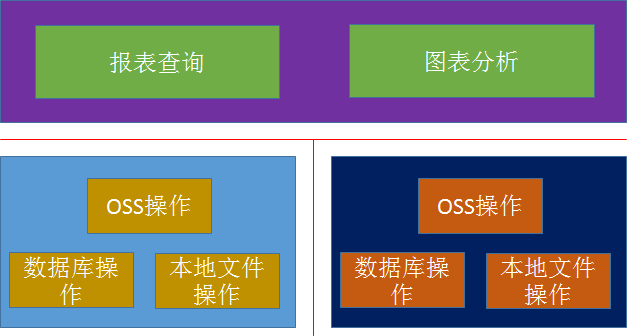

# SnoopAnalysis

一个用对应于aPaaS手机端日志的汇总分析非官方软件

## 模块构成

## 技术栈

三端技术混合

### Flutter SDK + Dart

实现统一的UI交互操作，及对来自下层相同原始数据的二次处理

### Win32API + C++

基于alioss SDK实现对oss访问

基于sqlite对文件内容进行存储

基于oss取得的文件进行解析

### Cocoa + Swift

基于alioss SDK实现对oss访问

基于sqlite对文件内容进行存储

基于oss取得的文件进行解析

## 技术验证过程

这次技术验证，主要时间花费在开发工具链的部署上，因为目前无论是官方还是网文，都没有完整或确实可行的部署指导

开发过程用到的C++库，如rapidjson，对这些，不打算做深入源码学习，因为对移动端没有借鉴的价值，sqlite3库的源码和移动一致，已看过多次，另外，常用的win32API和10多年基本一致，更多得API会随着工程的深入，自然会用到。反倒是flutter与原生交互的MothedChannel内部源码，倒是可以学习，毕竟flutter是和移动端有关联的，而且也有性能问题，但这时MVP之后的事情，目前最主要的把功能躺平

以window7为例，说说如何部署

1.下载Git for Windows

2.下载最新Dev Channel安装包“https://flutter.dev/docs/development/tools/sdk/releases#windows”
注意：不能通过"git clone"的下载github上任意版本，因为这些版本不包含“dart tool”，也不包含“pub”访问配置，即使按照目前网上的教程进行临时镜像配置，也将无法进行任何flutter命令的操作

因为，每输入一次flutter命令，都会检查它自己的依赖项并进行编译

3.解压文件，配置用户环境变量，指定“flutter/bin”访问路径

4.下载PowerShell 5.0以上版本，以操作flutter命令

5.在PowerShell中输入"flutter version"或任意flutter命令验证配置是否成功

若配置成功，该命令将返回一串可用版本

6.下载并安装vscode

7.下载并安装vs2019任意版本，如图进行勾选安装

.png)

.png)

安装英文语言包主要是用于vcpkg

8.若不涉及第三方C++库的使用，到此，需要安装的工具都已经完成，下面进行Flutter for windows desktop配置

9.输入“flutter channel master”切换到master分支

8.输入“flutter upgrade”更新

10.输入“flutter config --enable-windows-desktop”开启桌面开发功能

11.输入“flutter devices”连接pc

12.输入“flutter doctor”检查，如图，恭喜你，完成第一阶段的填坑

.png)

13.在windows下，native侧只能以plugin方式与flutter交互，输入“flutter create --template=plugin xxx”创建一个插件

14.找到xx目录下的pubspec.yaml，开启插件对windows的支持

.png)

15.输入“cd xx\example”切换到example目录

16.输入“flutter run”配置并构建example工程，这个工程将帮助你测试并开发native侧plugin的

17.当你看到“Running on：Windows 7”的弹出窗口时候，表示example工程已经配置好，关闭弹窗

18.打开“xx\example\windows\Runner.sln”，然后关闭，这时vs会提示你对sln进行保存，保存即可

19.再次打开Runner.sln，按F5开始调试，过一段时间，若再次弹出窗口，恭喜你，完成第二阶段的填坑

至此，你可以开始native侧的代码开发及编写了

.png)

xx为插件工程，Runner为example的宿主窗口工程，FlutterBuild为Native侧的Flutter dll工程，后两个工程为自动生成，并且每次F5时都会被重置

若在开发过程中用到第三方C++库，建议使用vcpkg进行管理，网上有成熟且完整的教程，这里不详述

目前用到第三方的C++库为rapidjson和sqlite3，都能通过vcpkg找到

唯一需要注意的是，plugin及example工程只支持64位，故此，下载C++库你应该输入，如“.\vcpkg.exe install RapidJSON:x64-windows”，否则默认为32位

开发过程不述，win32api + c++，效率真的很低……

## 最后上一张图

文件导入到数据库后，并把结果在界面上显示

.png)